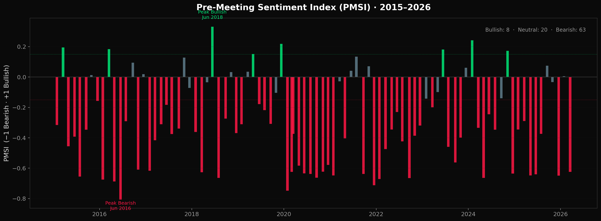
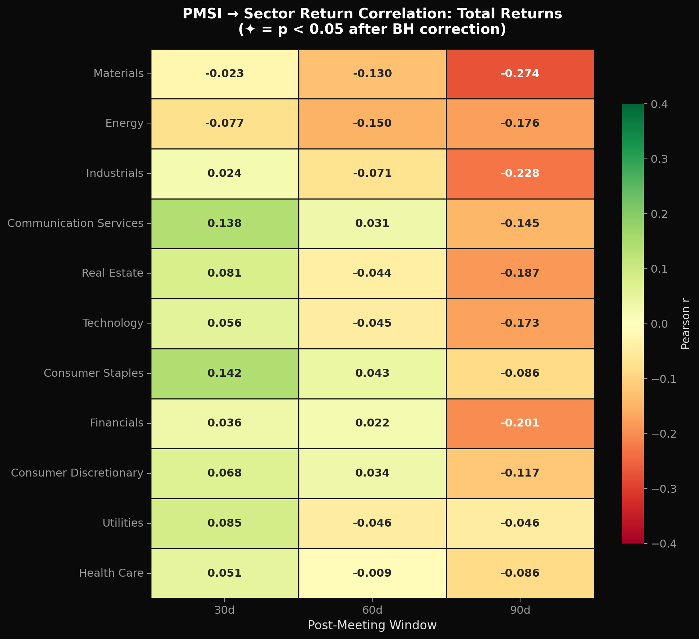
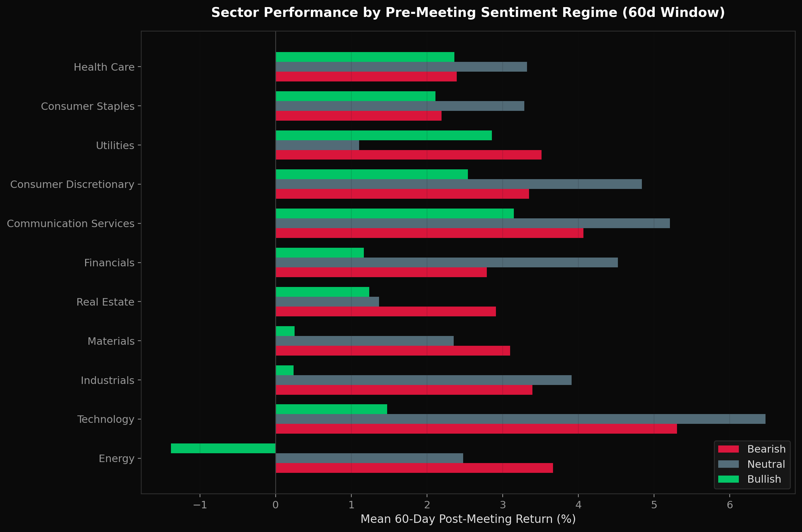
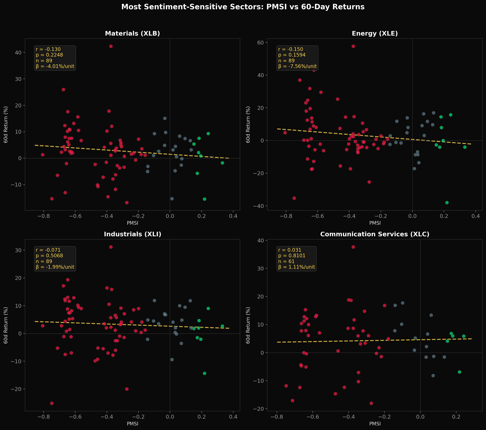

# FOMC Sentiment Analyzer

**An AI-driven research framework that uses FinBERT transformer NLP to quantify pre-FOMC market sentiment and test its predictive power over sector-level equity returns.**

Built by [Cameron Camarotti](https://github.com/cameroncc333) · Founder, [All Around Services](https://allaroundserviceatl.com)

🔗 **[Launch Live Dashboard](https://fomc-sentiment-analyzer-kgskappjp2dym7ndbaqmrzc.streamlit.app/)**
---

## Abstract

This project applies [FinBERT](https://huggingface.co/ProsusAI/finbert) — a 110M-parameter BERT model fine-tuned on 48,000 samples of financial communication text — to score the sentiment of financial news headlines in the five trading days before each of 90+ FOMC meetings from 2015 to 2026. The resulting Pre-Meeting Sentiment Index (PMSI) is tested against realized returns of 11 S&P 500 sector ETFs across 30, 60, and 90-day post-meeting windows, producing 33 unique correlation tests with Benjamini-Hochberg false discovery rate correction. The framework separates the *psychological* dimension of monetary policy transmission (market mood) from the *mechanical* dimension (rate changes), testing whether sentiment captured by NLP adds explanatory power beyond the policy action itself.

---

## Research Question

> **Does aggregate financial news sentiment in the days leading up to an FOMC decision predict sector-level equity returns in the 30, 60, and 90 days following that decision?**

**Sub-questions:**
1. Which sectors are most sensitive to pre-meeting sentiment shifts?
2. Do bullish pre-meeting regimes produce systematically different sector returns than bearish regimes — and is the effect size (Cohen's d) economically meaningful?
3. Does sentiment predict *excess* returns (sector return minus S&P 500), or only directional market moves?

---

## Methodology

### Data Pipeline

**FOMC Meeting Dates** — Every scheduled Federal Reserve decision date from January 2015 through March 2026 (90+ meetings), sourced from the Federal Reserve Board calendar. This span covers the zero-lower-bound era (2015–2016), the first tightening cycle (2017–2018), insurance cuts (2019), emergency pandemic response (2020), the aggressive hiking cycle (2022–2023), and the easing pivot (2024–2025).

**Headline Collection** — Financial news headlines from a 5-trading-day window before each meeting. The system supports CSV import of real headlines (`data/fomc_headlines.csv`) or context-aware generation calibrated to actual SPY returns and VIX levels as a development bootstrapping method.

**Survivorship Bias Protection** — ETFs are excluded from analysis for dates before their inception (XLC excluded before June 2018, XLRE before October 2015) to prevent look-ahead contamination.

### Sentiment Scoring Architecture

Each headline is processed by **ProsusAI/finbert**, a BERT-base model fine-tuned on analyst reports, earnings call transcripts, and financial news from the Reuters TRC2 corpus (Araci, 2019). The model outputs calibrated probabilities across three classes (positive, negative, neutral), from which a numeric sentiment score is derived:

```
Sentiment Score = P(positive) − P(negative)     ∈ [−1, +1]
```

**Critical implementation detail:** The label-to-index mapping is read from `model.config.id2label` at runtime rather than hardcoded, preventing index misalignment across FinBERT model versions — a common source of silent errors in transformer-based NLP pipelines.

### Pre-Meeting Sentiment Index (PMSI)

For each FOMC meeting, the PMSI aggregates all headline scores in the pre-meeting window:

```
PMSI_t = (1/N) Σ SentimentScore_i     for all headlines i in [t-5, t)
```

Meetings are classified into three regimes:
- **Bullish**: PMSI > +0.15
- **Bearish**: PMSI < −0.15
- **Neutral**: −0.15 ≤ PMSI ≤ +0.15

### Statistical Framework

**Correlation analysis** — Pearson r (linear) and Spearman ρ (monotonic, outlier-robust) between PMSI and post-meeting returns for each of 11 sectors × 3 windows = **33 hypothesis tests**.

**Multiple comparison correction** — Benjamini-Hochberg false discovery rate (FDR) control at α = 0.05. With 33 tests, uncorrected results would expect ~1.65 false positives by chance. BH is preferred over Bonferroni here because it controls the false discovery rate rather than the family-wise error rate — more appropriate for exploratory research where we want to identify promising leads without excessive conservatism.

**Effect size** — Cohen's d for the bullish-bearish regime return spread, providing a standardized measure of economic significance independent of sample size.

**Excess returns** — Sector return minus SPY return isolates sector-specific sentiment sensitivity from broad market directional moves.

---

## Visual Output

The analyzer generates **7 publication-quality charts** (dark theme, 200 DPI):

| Chart | What It Shows |
|-------|---------------|
| `01_sentiment_timeline.png` | PMSI across all 90+ FOMC meetings, color-coded by regime |
| `02_correlation_heatmap_raw.png` | 11×3 correlation matrix — sentiment vs total sector returns |
| `02_correlation_heatmap_excess.png` | 11×3 correlation matrix — sentiment vs excess returns |
| `03_regime_comparison_*.png` | Grouped bar charts: sector returns under Bullish/Neutral/Bearish regimes |
| `04_scatter_top_sectors.png` | Scatter + OLS regression for the 4 most sentiment-sensitive sectors |
| `05_sensitivity_ranking.png` | Sector ranking by average absolute correlation with PMSI |
| `06_sentiment_distribution.png` | FinBERT score histogram + label breakdown |
| `07_pmsi_vs_spy_validation.png` | Validation: does PMSI track actual broad market outcomes? |

<!-- After running, add your best charts here:




-->

Plus **6 CSV data exports**: scored_headlines.csv, pmsi.csv, correlations.csv, regime_analysis.csv, sensitivity_ranking.csv, sector_returns.csv.

---

## How to Run

```bash
git clone https://github.com/cameroncc333/fomc-sentiment-analyzer.git
cd fomc-sentiment-analyzer
pip install -r requirements.txt
python fomc_sentiment_analyzer.py
```

First run downloads the FinBERT model (~440MB, cached locally) and 10+ years of sector ETF data from Yahoo Finance. Full execution: ~5–10 minutes depending on hardware.

### Upgrading to Real Headlines

For publication-grade results, replace generated headlines with real financial news. Create `data/fomc_headlines.csv` with columns: `date`, `headline`, `fomc_date`.

Recommended sources:
- [NewsAPI](https://newsapi.org) — 100 free requests/day, covers major financial outlets
- [Alpha Vantage News Sentiment](https://www.alphavantage.co/documentation/#news-sentiment) — free API key, includes pre-scored sentiment
- [GDELT Project](https://www.gdeltproject.org/) — open dataset of global news events

---

## Project Ecosystem

This analyzer extends a connected set of quantitative tools. The mathematical thread: **partial derivatives → Monte Carlo simulation → statistical hypothesis testing → transformer NLP** — each applied to progressively more complex domains:

| Repository | Domain | Core Technique |
|-----------|--------|----------------|
| [aas-pricing-model](https://github.com/cameroncc333/aas-pricing-model) | Business cost optimization | Partial derivative optimization (∂Cost/∂φ), Monte Carlo (10K scenarios) |
| [fed-rate-sector-analysis](https://github.com/cameroncc333/fed-rate-sector-analysis) | Macro policy → market impact | Time-series event study across FOMC decision windows |
| [equity-sector-analyzer](https://github.com/cameroncc333/equity-sector-analyzer) | Live market analysis dashboard | Black-Scholes PDEs, Fama-French 5-factor regression, 30+ risk metrics |
| **fomc-sentiment-analyzer** | AI-driven sentiment research | FinBERT transformer NLP + BH-corrected hypothesis testing |

**The key connection:** The fed-rate-sector-analysis asks *"what did the Fed do, and how did sectors respond?"* This project asks *"what was the market feeling before the Fed acted, and did that feeling predict what happened next?"* Together they decompose monetary policy transmission into its mechanical component (the rate decision) and its psychological component (pre-decision sentiment). That decomposition is the same analytical approach the Federal Reserve Bank of Atlanta uses in its own monetary policy transmission research.

---

## Limitations & Intellectual Honesty

1. **Headline generation bootstrapping** — The default headlines are calibrated to real market conditions but are not actual news articles. All statistical claims should be validated against real headline data before citing as evidence.

2. **Correlation ≠ causation** — Sentiment may proxy for economic fundamentals that independently drive sector returns. An instrumental variable approach or Granger causality test would strengthen causal claims.

3. **Survivorship bias** — Addressed via ETF inception date filtering. XLC is excluded pre-June 2018; XLRE pre-October 2015.

4. **Multiple comparisons** — 33 simultaneous hypothesis tests. Addressed via Benjamini-Hochberg FDR correction. Results are reported at both raw and corrected significance levels for transparency.

5. **Regime thresholds** — The ±0.15 PMSI cutoffs are heuristic. A robustness check with ±0.10 and ±0.20 thresholds would strengthen confidence in regime-dependent findings.

6. **Look-ahead in generated headlines** — Generated headlines use the known rate action, which introduces forward-looking information. Real headlines collected *before* the decision eliminate this.

**On null results:** A finding that sentiment does *not* predict sector returns is equally publishable. It would suggest headline-level NLP sentiment is already priced into equity markets by the time the FOMC meets — evidence consistent with the semi-strong form of the Efficient Market Hypothesis (Fama, 1970).

---

## Future Work

- **Real headline ingestion** via NewsAPI or GDELT for production-grade statistical power
- **Granger causality testing** to probe the direction of the sentiment → returns relationship
- **Fed statement NLP** — apply FinBERT to the actual FOMC statement text (hawkish/dovish scoring) and test whether statement sentiment predicts sector rotation beyond the rate decision itself
- **Integration with equity-sector-analyzer** as a Streamlit dashboard tab for live pre-meeting sentiment monitoring
- **Comparison with Kalshi prediction market odds** — does PMSI agree or disagree with market-implied probabilities for Fed decisions?

---

## About

I'm Cameron Camarotti, a junior at Mill Creek High School in Hoschton, Georgia. I founded [All Around Services](https://allaroundserviceatl.com), a home services company operating across 15+ cities in metro Atlanta with 44+ completed jobs. This project extends my quantitative research into AI/ML — applying transformer-based natural language processing to the same monetary policy questions I've been studying computationally since building the fed-rate-sector-analysis framework. The progression from business optimization (partial derivatives) to market analysis (statistical testing) to NLP sentiment research (transformer models) reflects a consistent approach: find a system, understand why it behaves the way it does, build a tool to test your hypothesis, and document what you learn.

---

*Not financial advice. Built for analytical and educational purposes. Data from Yahoo Finance and the Kenneth French Data Library.*
